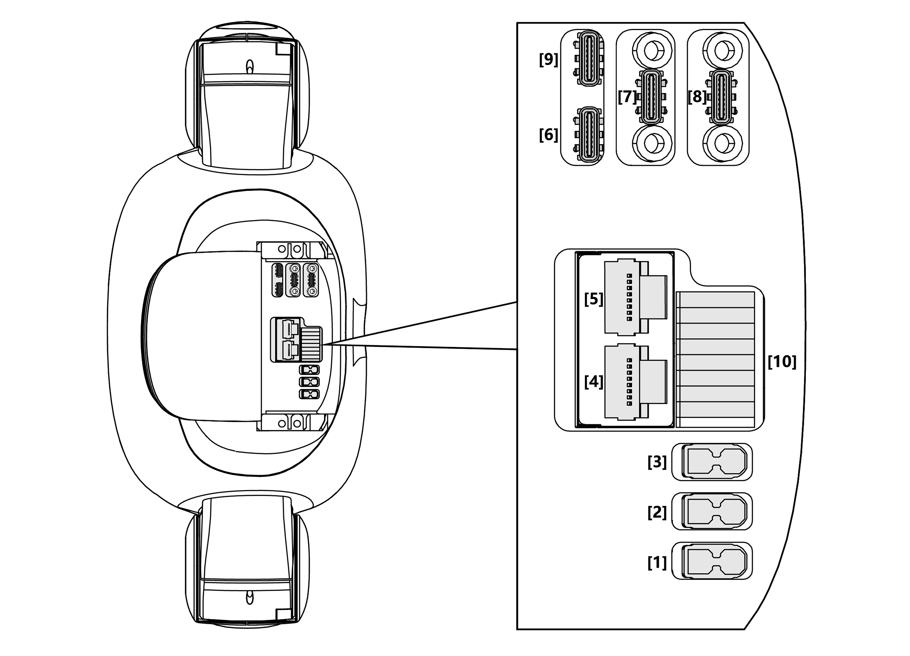
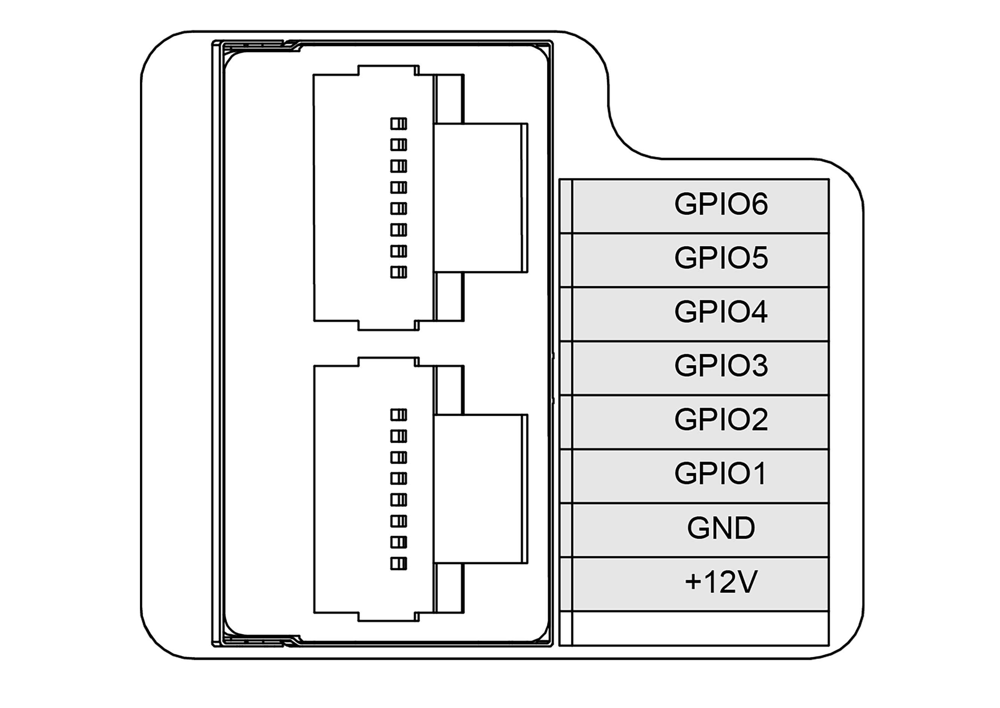

**
G1
**

Revision History
================

+----------+-------------------+-------------+------------------------------------------------------+
| Revision | Date (DD/MM/YYYY) | Author      | Changes                                              |
+==========+===================+=============+======================================================+
| 1        | 22/4/2025         | Kang Wei    | Initial release                                      |
+----------+-------------------+-------------+------------------------------------------------------+

1. Overview
===========

The G1 is a humanoid robot that stands 130 cm tall and weighs 35 kg. It comes equipped with a LIVOX MID-360 LiDAR and an Intel RealSense D435i depth camera.

2. Specifications
=================

2.1 Technical Specifications
----------------------------
.. list-table::
   :header-rows: 1
   :widths: 35 30 30

   * - Model
     - G1
     - G1-EDU
   * - Height, Width and Thickness (Stand)
     - 1320x450x200mm
     - 1320x450x200mm
   * - Height, Width and Thickness (Fold)
     - 690x450x300mm
     - 690x450x300mm
   * - Weight (With Battery)
     - About 35kg
     - About 35kg
   * - Total Degrees of Freedom (Joint Freedom)
     - 23
     - 23~43
   * - Single Leg Degrees of Freedom
     - 6
     - 6
   * - Waist Degrees of Freedom
     - 1
     - 1+ (Optional 2 additional waist degrees of freedom)
   * - Single Arm Degrees of Freedom
     - 5
     - 5
   * - Single Hand Degrees of Freedom
     - /
     - 7 (Optional Force control of three-fingered hand) + 2 (Optional 2 additional wrist degrees of freedom)
   * - Joint Output Bearing
     - Industrial grade crossed roller bearings (high precision, high load capacity)
     - Industrial grade crossed roller bearings (high precision, high load capacity)
   * - Joint Motor
     - Low inertia high-speed internal rotor PMSM (better response speed and heat dissipation)
     - Low inertia high-speed internal rotor PMSM (better response speed and heat dissipation)
   * - Maximum Torque of Knee Joint [1]
     - 90N.m
     - 120N.m
   * - Arm Maximum Load [2]
     - About 2Kg
     - About 3Kg
   * - Calf + Thigh Length
     - 0.6M
     - 0.6M
   * - Arm Span
     - About 0.45M
     - About 0.45M
   * - Extra Large Joint Movement Space
     - | Waist joint: Z±155°  
       | Knee joint: 0~165°  
       | Hip joint: P±154°, R-30~+170°, Y±158°
     - | Waist joint: Z±155°, X±45°, Y±30°  
       | Knee joint: 0~165°  
       | Hip joint: P±154°, R-30~+170°, Y±158°  
       | Wrist joint: P±92.5°, Y±92.5°
   * - Full Joint Hollow Electrical Routing
     - YES
     - YES
   * - Joint Encode
     - Dual encoder
     - Dual encoder
   * - Cooling System
     - Local air cooling
     - Local air cooling
   * - Power Supply
     - 13 string lithium battery
     - 13 string lithium battery
   * - Basic Computing Power
     - 8-core high-performance CPU
     - 8-core high-performance CPU
   * - Sensing Sensor
     - Depth Camera + 3D LiDAR
     - Depth Camera + 3D LiDAR
   * - 4 Microphone Array
     - YES
     - YES
   * - 5W Speaker
     - YES
     - YES
   * - WiFi 6, Bluetooth 5.2
     - YES
     - YES
   * - High Computing Power Module
     - /
     - NVIDIA Jetson Orin
   * - Smart Battery (Quick Release)
     - 9000mAh
     - 9000mAh
   * - Charger
     - 54V 5A
     - 54V 5A
   * - Manual Controller
     - YES
     - YES
   * - Battery Life
     - About 2h
     - About 2h
   * - Upgraded Intelligent OTA
     - YES
     - YES
   * - Secondary Development [3]
     - /
     - YES

2.2 Electrical Interfaces
-------------------------

.. list-table::
   :header-rows: 1
   :widths: 5 20 25 50

   * - No.
     - Connector Name
     - Interface Description for short
     - Interface specification
   * - 1
     - XT30UPB-F
     - VBAT
     - 58V/5A Battery power output (directly connected to battery power here)
   * - 2
     - XT30UPB-F
     - 24V
     - 24V/5A power output
   * - 3
     - XT30UPB-F
     - 12V
     - 12V/5A power output
   * - 4
     - RJ45
     - 1000 BASE-T
     - GbE (gigabit Ethernet)
   * - 5
     - RJ45
     - 1000 BASE-T
     - GbE (gigabit Ethernet)
   * - 6
     - Type-C
     - Type-C
     - Support USB3.0 host, 5V/1.5A power output
   * - 7
     - Type-C
     - Type-C
     - Support USB3.0 host, 5V/1.5A power output
   * - 8
     - Type-C
     - Type-C
     - Support USB3.0 host, 5V/1.5A power output
   * - 9
     - Type-C
     - Alt Mode Type-C
     - Supports USB3.2 host and DP1.4
   * - 10
     - 5577
     - I/O OUT
     - 12V: 12V/3A power output  
       See the following table for GPIO details

.. list-table::
   :header-rows: 1
   :widths: 10 15 30 30

   * - GPIO Number
     - NX Pin Number
     - Multiplexing Relationship
     - Pin name of the debugfs file system
   * - GPIO1
     - 203
     - UART1_TXD
     - GPIO3_PR.02
   * - GPIO2
     - 205
     - UART1_RXD
     - GPIO3_PR.03
   * - GPIO3
     - 232
     - I2C2_SCL
     - GPIO3_PI.03
   * - GPIO4
     - 234
     - I2C2_SDA
     - GPIO3_PI.04
   * - GPIO5
     - 128
     - GPIO
     - GPIO3_PCC.02
   * - GPIO6
     - 130
     - GPIO
     - GPIO3_PCC.03

.. note::
    There are many ways to operate NVIDIA GPIO, refer to this `link <https://docs.nvidia.com/jetson/archives/r35.2.1/DeveloperGuide/text/HR/JetsonModuleAdaptationAndBringUp/JetsonOrinNxSeries.html#identifying-the-gpio-number>`_ for the definition.

2.3 On-board Computer
---------------------
G1 Edu has 2 onboard computers:

- Operation & Control computing unit (Not accessible to public)
 
  - IP: 192.168.123.161
   
- User development computing unit
 
  - IP: 192.168.123.164
  - Username: unitree
  - Password: Unitree0408

.. list-table::
   :header-rows: 1
   :widths: 30 70

   * - Parameter
     - Development Computing Unit
   * - Model
     - Jetson Orin NX
   * - CPU
     - Arm® Cortex®-A78AE
   * - Number of cores
     - 8
   * - Number of threads
     - 8
   * - Max largest rate
     - 2 GHz
   * - Graphic memory
     - 16G
   * - Memory
     - 16G
   * - Cache
     - 2MB L2 + 4MB L3
   * - Storage
     - 2T
   * - Intel® Image Processing Unit
     - No
   * - GPU
     - 1024 NVIDIA Ampere architecture GPUs with 32 Tensor cores
   * - Maximum dynamic frequency of graphics card
     - 918 MHz
   * - Gaussian and Neuro Accelerator
     - 3.0
   * - Intel® Deep Learning Promotion
     - Yes
   * - Intel® Adaptix™ Technology
     - Yes
   * - Intel® Hyperthreading Technology
     - Yes
   * - Instructions set
     - 64bit
   * - OpenGL
     - 4.6
   * - OpenCL
     - 3.0
   * - DirectX
     - 12.1

3. Resources
============

Basic Guides
------------

* G1 Manual: `Unitree <https://support.unitree.com/home/en/G1_developer>`_
* Training Slides: `G1 Basic Training <https://tangrobot.sharepoint.com/:b:/s/Public-Outgoing/EYW7e2v3tL1DtCeW-HGdQo8BlBn-CkYQve05OhJDlS7xcA?e=5kJQpt>`_

Development
-----------

* SDK Support: `unitree_sdk2 <https://github.com/unitreerobotics/unitree_sdk2>`_
* ROS2 Support: `unitree_ros2 <https://github.com/unitreerobotics/unitree_ros2>`_